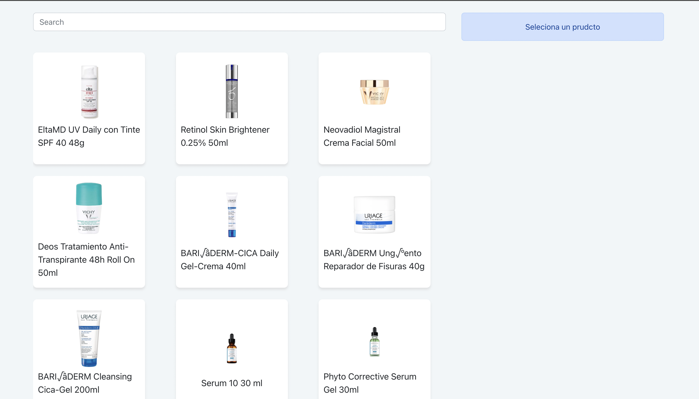
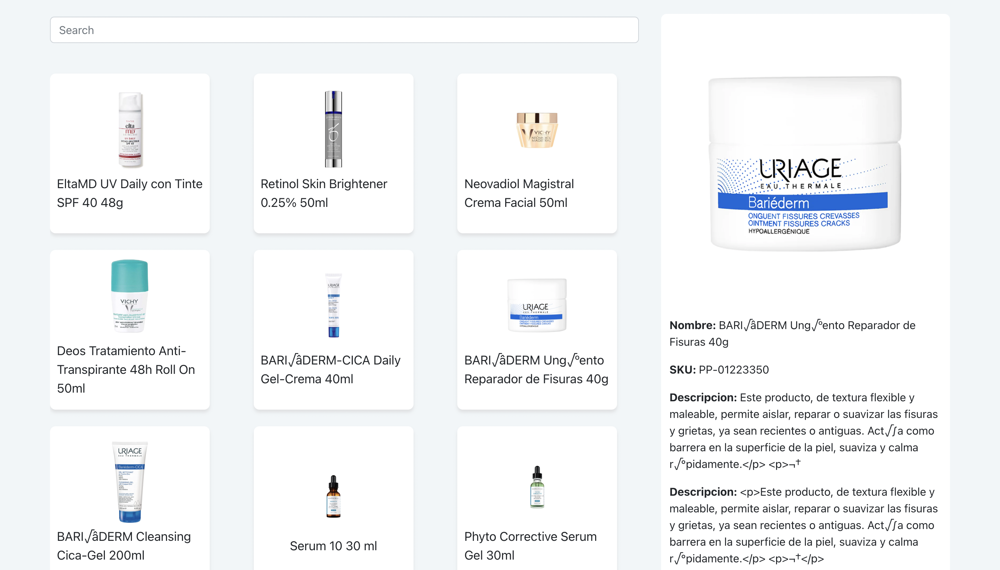
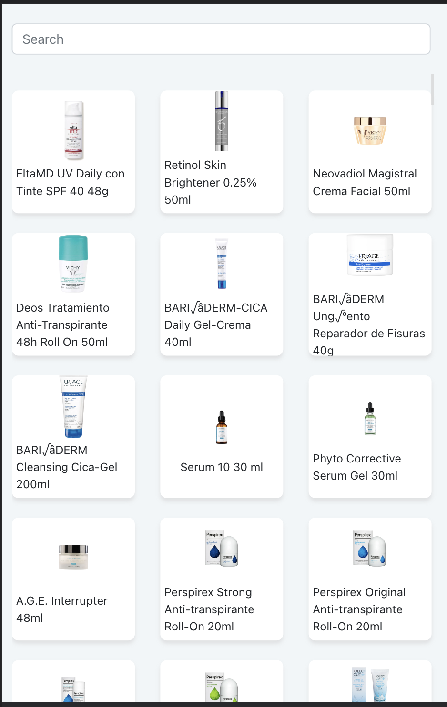
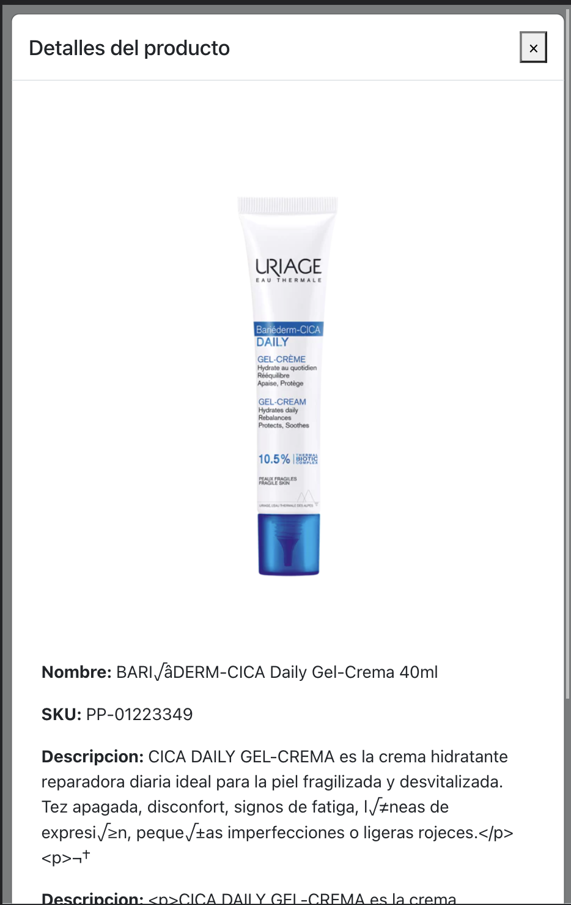

## Aplicación productos

La aplicación es una sigle page desarrollada con el framework de [ReactJS](https://reactjs.org/docs/getting-started.html) con el template de TypeScript

This project was bootstrapped with [Create React App](https://github.com/facebook/create-react-app)

### Dependencias:

- axios v1.1.2
- bootstrap v5.2

### Pasos para correr el proyecto:

Abiri el proyecto en su terminal intregada y ejecutar los siguientes comandos

`npm install`

`npm start`

### Capturas de la aplicacion corriendo

